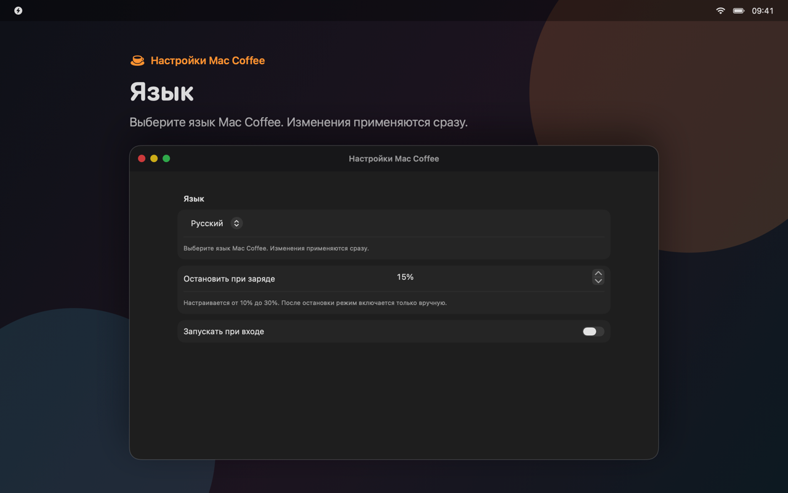

# Mac Coffee

A native macOS menu bar app that prevents idle sleep.

**English** · [Русский](README.ru.md) · [简体中文](README.zh-Hans.md)

| Wake session | Settings |
| --- | --- |
|  |  |

Mac Coffee uses process-owned IOKit power assertions. It does not install a privileged helper, change `pmset`, collect analytics, or use a backend. Assertions are released when a session ends or the app exits.

## Install

Mac Coffee requires macOS 13 Ventura or later.

### Homebrew

```sh
brew tap rekurt/maccoffee
brew install --cask maccoffee
```

### DMG

Download the signed and notarized DMG from the [latest release](https://github.com/rekurt/Mac-Coffee/releases/latest), open it, and move Mac Coffee to Applications.

## Usage

1. Open the coffee cup menu bar item.
2. Select **Keep Mac Awake** or **Keep Display Awake**.
3. Select a duration: 30 minutes, 1, 2, 4, or 8 hours, or indefinitely.
4. Select **Off** to end the session.

Settings include a 10–30% battery cutoff, Launch at Login, notifications, update checks, language selection, and MCP configuration. The default battery cutoff is 15%.

The interface is available in English, Russian, German, French, Simplified Chinese, Japanese, Korean, and Spanish. VoiceOver labels are included.

Mac Coffee prevents idle sleep only. Manual sleep, lid closure, shutdown, restart, thermal protection, and other macOS safety mechanisms still apply.

## Local MCP server

The Direct build includes an optional stdio MCP server for Codex, Claude Desktop, and other MCP clients. It is disabled by default.

Enable it under **Settings → AI & automation**, then use the setup wizard to review and install the client configuration. Clients must pair with a running Mac Coffee instance. Credentials are stored in Keychain, and connections are limited to the current macOS user.

Tools:

- `maccoffee_get_status`
- `maccoffee_set_session`
- `maccoffee_stop_session`
- `maccoffee_set_battery_threshold`
- `maccoffee_set_launch_at_login`
- `maccoffee_set_language`

Resources:

- `maccoffee://status`
- `maccoffee://capabilities`
- `maccoffee://activity`

See [MCP setup and security](docs/MCP.md) for configuration examples, schemas, and troubleshooting.

## Build from source

A source build requires Xcode and the tools listed in the [`Brewfile`](Brewfile).

```sh
brew bundle
./scripts/build-local.sh direct
open "dist/local/Mac Coffee.app"
```

The local build is ad hoc signed and intended for testing on the current Mac.

Run the test suite:

```sh
DEVELOPER_DIR=/Applications/Xcode.app/Contents/Developer \
  xcodebuild test \
  -project MacCoffee.xcodeproj \
  -scheme MacCoffeeTests \
  -destination 'platform=macOS' \
  CODE_SIGNING_ALLOWED=NO
```

Build and verify both distribution variants:

```sh
xcodegen generate
./scripts/build-local.sh direct
./scripts/build-local.sh app-store
./scripts/verify-release-assets.sh
./scripts/verify-bundles.sh
```

XCUITests require an unlocked interactive desktop.

## Project structure

| Component | Purpose | Distribution |
| --- | --- | --- |
| `MacCoffeeCore` | Power assertions, preferences, localization, and shared UI | Direct |
| `MacCoffeeAppStoreCore` | Store-safe core without MCP symbols | App Store |
| `MacCoffeeDirect` | Direct app, Sparkle updates, and MCP lifecycle | Direct |
| `MacCoffeeMCP` | Embedded stdio MCP helper | Direct |
| `MacCoffeeMCPBroker` | XPC broker between the helper and the running app | Direct |
| `MacCoffeeAppStore` | Sandboxed App Store app without Sparkle or MCP | App Store |
| `MacCoffeeScreenshots` | Deterministic App Store screenshot renderer | Development only |

Wake sessions use `IOPMAssertionCreateWithName`. Battery changes come from IOPowerSources notifications rather than polling.

Detailed documentation:

- [Architecture](docs/ARCHITECTURE.md)
- [Privacy policy](PRIVACY.md)
- [Security](docs/SECURITY.md)
- [App Store submission](docs/APP_STORE_SUBMISSION.md)

## Release

Create a signed and notarized Direct release:

```sh
./scripts/release-direct.sh
```

The script requires a Developer ID certificate, notarization credentials, an HTTPS appcast URL, and a Sparkle EdDSA public key.

Create an App Store archive:

```sh
MACCOFFEE_APP_STORE_TEAM=YOUR_TEAM_ID ./scripts/archive-app-store.sh
```

The App Store build does not contain Sparkle, the MCP helper, or the MCP broker. See the [release checklist](docs/RELEASE_CHECKLIST.md) before publishing a build.

App Store screenshots are generated from production SwiftUI views:

```sh
./scripts/generate-screenshots.sh
```

## Privacy and security

Mac Coffee does not collect personal data. The Direct build connects only to the configured Sparkle appcast for update checks. MCP traffic stays on the local Mac and its activity log is kept in memory with a fixed size limit.

Report vulnerabilities using the [security policy](docs/SECURITY.md). Use [GitHub Issues](https://github.com/rekurt/Mac-Coffee/issues) for bugs and support requests.

## Upgrading from 1.x

Version 2.0 does not install or call the privileged helper used by 1.x. If an older version was installed, follow the [legacy cleanup guide](docs/LEGACY_CLEANUP.md). Cleanup requires explicit administrator approval and never runs automatically.

## Contributing

See [Contributing](docs/CONTRIBUTING.md) and the [Code of Conduct](docs/CODE_OF_CONDUCT.md).

Mac Coffee is licensed under the [MIT License](LICENSE).

Forked from [Elliotwu-7/Mac-Coffee](https://github.com/Elliotwu-7/Mac-Coffee).
