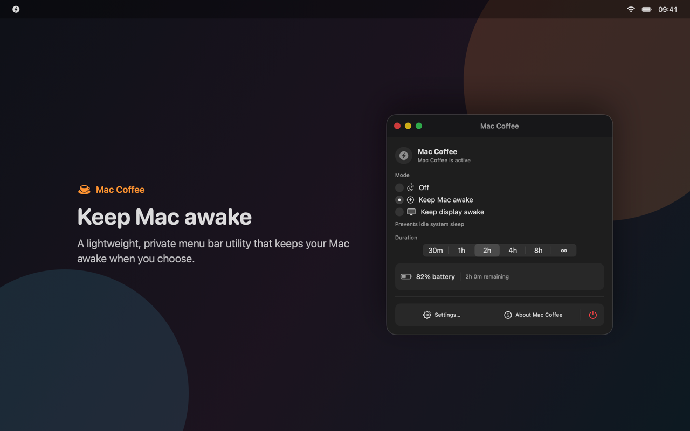

# Mac Coffee

[English](README.md) · **Русский** · [简体中文](README.zh-Hans.md)



Mac Coffee — лёгкое нативное приложение в строке меню macOS. Оно не даёт Mac автоматически уснуть только тогда, когда вы явно включили соответствующий режим. Приложение использует публичные IOKit assertions, принадлежащие процессу: без привилегированного helper, постоянных изменений `pmset`, аккаунта, аналитики и сервера.

## Возможности

- Режимы «Выкл.», «Не усыплять Mac» и «Не выключать экран».
- Сеансы на 30 минут, 1, 2, 4 или 8 часов либо без ограничения.
- Защита аккумулятора с порогом 10–30%, по умолчанию 15%, и гистерезисом.
- Запуск при входе через `SMAppService`, локальные уведомления и полная поддержка VoiceOver.
- Мгновенное переключение между системным языком, английским, русским, немецким, французским, упрощённым китайским, японским, корейским и испанским без перезапуска и сброса сеанса.
- Единое подтверждение выхода для кнопки в панели и `⌘Q`.
- В Direct-сборке: фоновая проверка обновлений, ненавязчивая карточка новой версии и ручная проверка в настройках.
- В Direct-сборке: опциональный локальный MCP-сервер для Codex, Claude Desktop и других stdio-клиентов.
- Отдельная sandbox-сборка для Mac App Store без Sparkle и MCP.

Mac Coffee предотвращает только сон из-за бездействия. Ручной сон, закрытие крышки, выключение, перезапуск и защитные решения macOS продолжают действовать.

## Установка

Требуется macOS 13 Ventura или новее.

Через Homebrew:

```sh
brew tap rekurt/maccoffee
brew install --cask maccoffee
```

Либо скачайте подписанный и нотарифицированный DMG из [последнего релиза](https://github.com/rekurt/Mac-Coffee/releases/latest).

Для локальной сборки:

```sh
brew bundle
./scripts/build-local.sh direct
open "dist/local/Mac Coffee.app"
```

## Использование

Откройте значок Mac Coffee в строке меню, выберите режим и длительность. В настройках доступны язык, порог батареи, запуск при входе, обновления и MCP-интеграция. Режим «Выкл.» и подтверждённый выход немедленно освобождают системный запрос бодрствования.

Локальная сборка подписана ad-hoc и предназначена только для тестирования на текущем Mac.

## Локальный MCP-сервер

MCP по умолчанию выключен и присутствует только в Direct-сборке. Включите его в **Настройки → ИИ и автоматизация**, откройте мастер установки, проверьте предлагаемые изменения и подтвердите настройку Codex или Claude Desktop. Для других клиентов мастер показывает готовую stdio-конфигурацию.

MCP-сервер не запускает Mac Coffee самостоятельно. Новый клиент должен пройти сопряжение с работающим приложением. В настройках видны ожидающие запросы, доверенные клиенты, отзыв доступа и ограниченный журнал локальной активности; секреты хранятся в Keychain.

Инструменты сервера управляют режимом и длительностью, останавливают сеанс, читают статус, меняют порог батареи, запуск при входе и язык. Ресурсы `maccoffee://status`, `maccoffee://capabilities` и `maccoffee://activity` предоставляют состояние и возможности.

Подробности: [настройка, модель безопасности и устранение неполадок MCP](docs/MCP.ru.md).

## Разработка и выпуск

```sh
brew bundle
xcodegen generate
./scripts/build-local.sh direct
./scripts/build-local.sh app-store
./scripts/verify-release-assets.sh
./scripts/verify-bundles.sh
```

Скриншоты App Store поддерживаются для английского, русского и упрощённого китайского, а интерфейс приложения — для всех восьми языков. Изображения воспроизводимо генерируются из production SwiftUI views командой `./scripts/generate-screenshots.sh`.

Полные инструкции находятся в [английском README](README.md), [архитектуре](docs/ARCHITECTURE.md), [политике конфиденциальности](PRIVACY.md), [руководстве App Store](docs/APP_STORE_SUBMISSION.md) и [релизном чек-листе](docs/RELEASE_CHECKLIST.md).

Ошибки и вопросы: [GitHub Issues](https://github.com/rekurt/Mac-Coffee/issues). Лицензия: [MIT](LICENSE).
